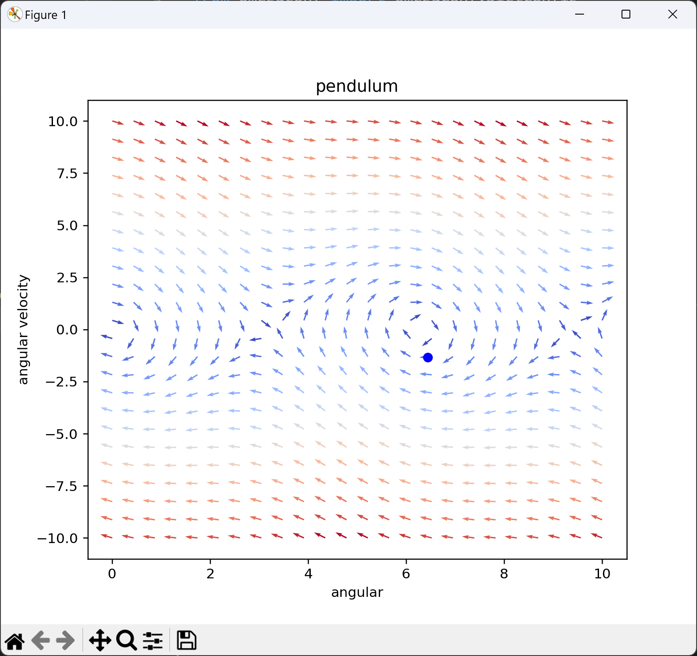
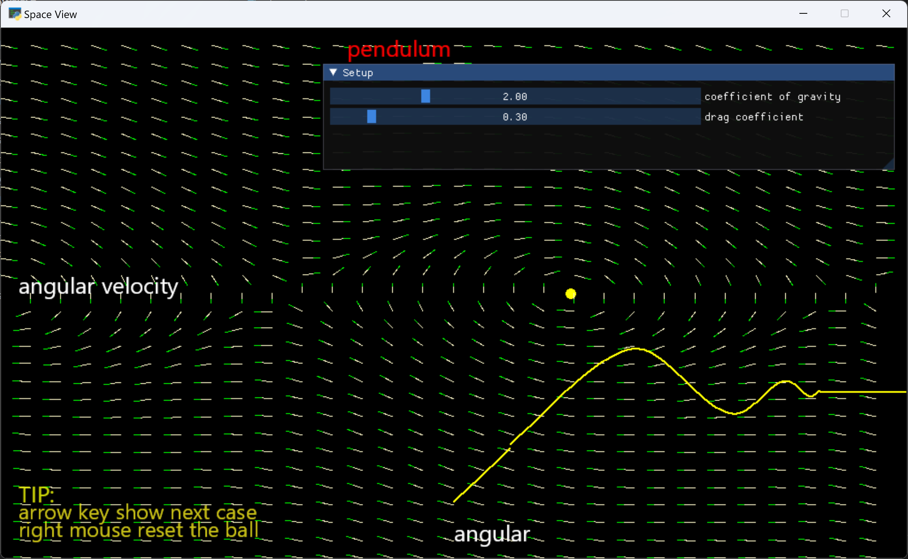

# FlowField
flow field demo 

## install
``` python
pip install -r requirements.txt
```

## show vector field
```
python  show.py
```



You can add your own example in the conf/problems directory 

## vector field playground
```
python  play.py
```



